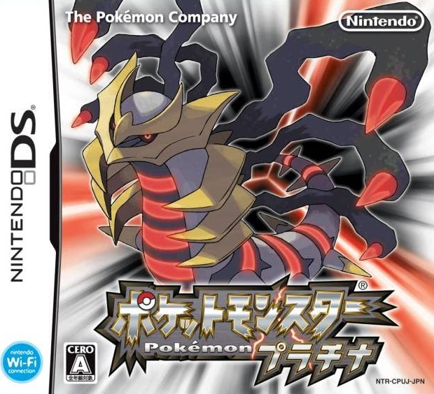

# Pokemon Like In JavaScript :

- Our idea was to create a Pokemon Game using JavaScript Langage, in order to achieve it, we used the Phaser FraweWork.
- In order to make the map, we used TILED a free software, that can create a TileMAP, which is good to use with Phaser FrameWork.
- We took few spritesheets, and tileset that came from Pokemon Platinum Game (or Poketto Monsutā Purachina in Japanese) made by **NINTENDO** in 2008.  

## Installation :

- If you want to try our game, you can go on this website: "https://pokemonlikejs.netlify.app/" (but it will take some time to load all the components), or you can download our files, put them into a folder, and launch a Live Server (LiveServer extension on VisualStudio Code), this way is faster than the other but require that you download all  our files.  

## How to play :

- First, you will need to use your arrows on your keyboard, in order to move you "player".
- You Can enter in the Pokemon Center or the Houses and check whats inside.  
 

## Fight against other Pokemon :

- If you want to fight some Pokemon, just go into the grass sections, walk and you will probably encounter a pokemon few seconds later.  

## Authors :
- MICHEL Anthony
- DUCOUDRE Antoine
- TRAN Alex
- TSOUMOU-BITA Ted
